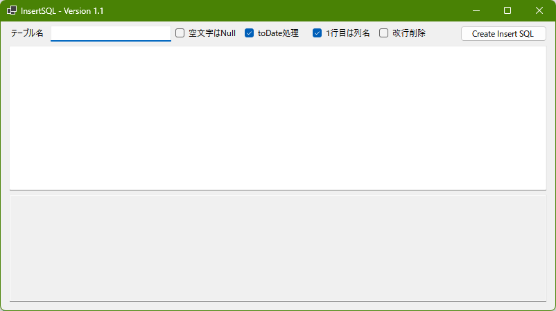

# InsertSQL

## プロジェクト概要
**InsertSQL** はデータベースへのInsert文をExcelで準備し、それを簡単にInsert文にするためのアプリケーションです。

## 主な機能
- タブ区切りのデータからInsert文を生成
- １行目を列名指定として設定可能
- 個人・商用問わず利用可能

## 使い方

- 画面左上にテーブル名を設定
- 上側のGridがデータ入力部
- 下側のGridがInsert生成部
- テーブル名を設定し、データ入力部にExcelからデータをコピペ、右上の"Create Insert SQL"を押下でInsert生成部にInsert文が出力されます。

## インストール
1. releasesから最新のzipをダウンロードし、任意のフォルダに解凍します。インストーラーはないため解凍するだけです。
2. InsertSQL.exeを起動し、いい感じに使います。
3. 以上

## アンインストール
1. インストールした際の任意のフォルダを削除します。
2. 以上

## その他
- チェックボックス
  - 空文字はNull・・・タブ文字が連続している場合、空文字があるものと判断します。その空文字を""とするかNullとするかを設定します。
  - toDate処理・・・Oracle向け。日付と解釈できるデータの時、toDateで括ります。
  - 1行目は列名・・・1行目を列名としてInsert文を作成します。登録不要な列のデータを用意する必要がありません。
  - 改行削除・・・データ内に改行が含まれている場合、それを除外してINSERT文を生成します。

## License
This project is licensed under the MIT License. See the LICENSE file for details.
